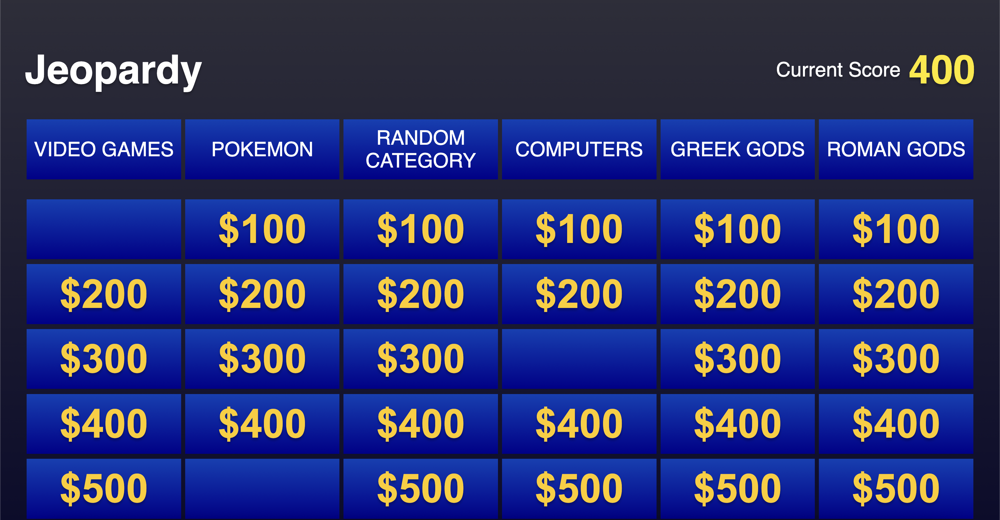
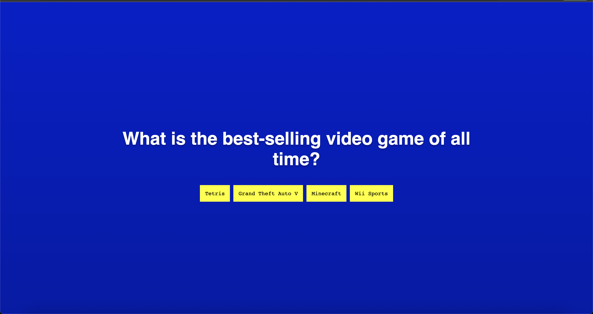
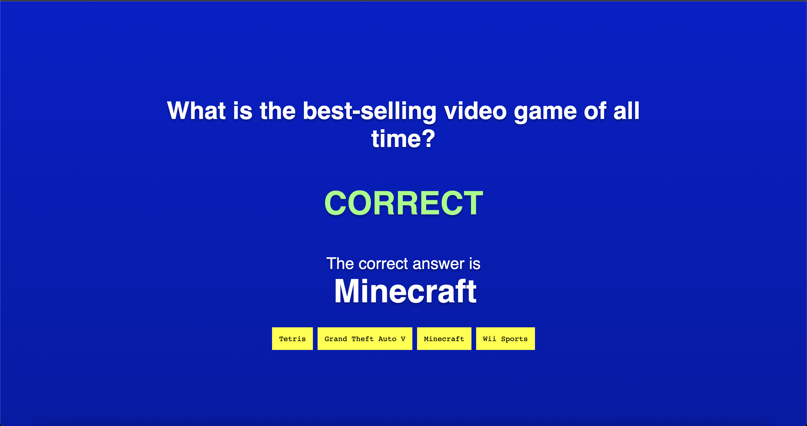
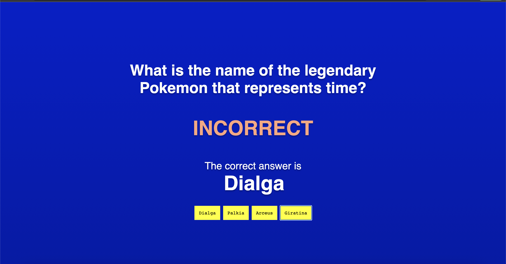

# README - CPSC - 462

## Overview
This project is a trivia game application built using Flask and JavaScript. The game loads categories and questions from JSON files, and users can select a question to answer. Users can either type their answer or select from multiple choice options. The game tracks the user's score and displays correct answers after each question.

## Prerequisites
- Python 3
- Flask
- A web browser that supports JavaScript

## Installation and Usage
1. Clone or download the repository.
2. Open a terminal and navigate to the project directory.
3. Run `python app.py` to start the Flask application.
4. Run `server.py` to start the localhost.
5. Open a web browser and go to `http://localhost:5000/` to play the game.

## Files
- `app.py`: This file contains the Flask application code.
- `index.html`: This file contains the HTML code for the game page.
- `style.css`: This file contains the CSS code for the game page.
- `script.js`: This file contains the JavaScript code for the game functionality.
- `static/categories/*.json`: These files contain the categories and questions for the game.

